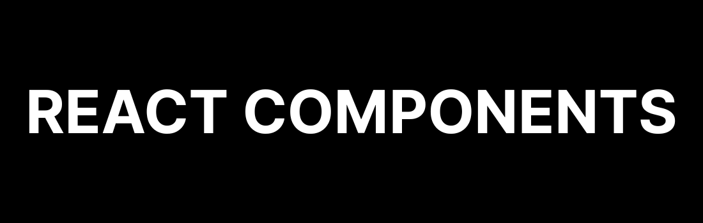

# Tailwind CSS Components

A collection of modern, responsive UI components built with React and Tailwind CSS, designed to be easily integrated into your projects.

## Features

- **React Components**: Modern and functional components ready to use.
- **Tailwind CSS Styled**: Leverages the power and flexibility of Tailwind CSS for styling. Easily customizable if your project also uses Tailwind.
- **Responsive Design**: Components are designed to look great on all screen sizes.
- **Simple to Use**: Designed with ease of integration in mind.
- **Lucide Icons**: Uses lightweight and beautiful icons from [Lucide React](https://lucide.dev/).

## Requirements

- React 19+
- TailwindCSS v4+
- Lucide-react 0.509+

## Usage

No installation needed, just copy the code from the components folder and run. To see all of the components, uncomment them in the `App.jsx` file.

## Current Components

- Newsletter signup.
- Product modal.
- Price grid.
- Simple Card/Popup
- Gallery

## License

This project is licensed under a MIT License.

## Acknowledgments

- Project created by [Syed Umair Ali](https://github.com/syedumaircodes)
